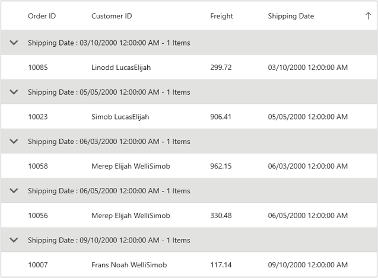
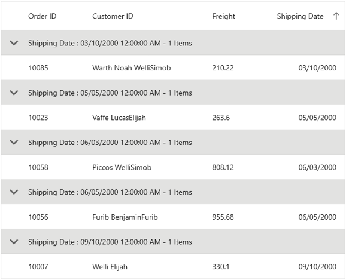
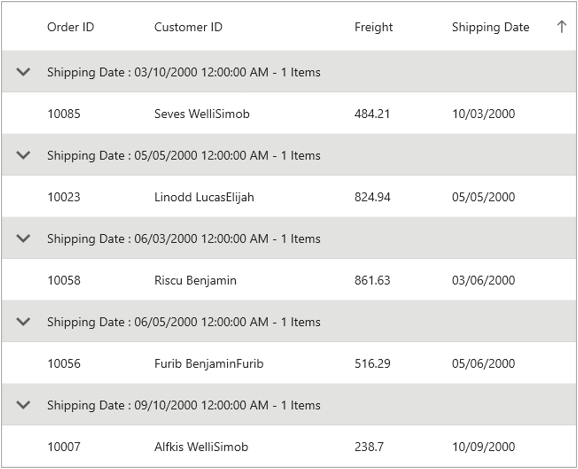

# How to group a column with DateTime values in .NET MAUI DataGrid SfDataGrid
[SfDataGrid](https://www.syncfusion.com/maui-controls/maui-datagrid) control allows you to group a column with DateTime data, however it will display the entire DateTime value including the time part in its cells, like in the following screenshot.

 
 

If you do not want to display the time part of the DateTime object then apply Format to the corresponding column. Refer the below code example. 
 ```XML
  <syncfusion:DataGridTextColumn MappingName="ShippingDate"
                                Format="dd/MM/yyyy"
                                HeaderText="Shipping Date" />
 ```
 
 In the following screenshot note the DateTime data in the ShippingDate column.

 

If your requirement is to group by a date column and also to display only the date part in the caption, then you can achieve it by writing a converter to apply the custom grouping logic. Refer the below code example. 
 ```XML
 <syncfusion:SfDataGrid.GroupColumnDescriptions>
    <syncfusion:GroupColumnDescription ColumnName="ShippingDate"
                                       Comparer="{StaticResource groupDateTimeConverter}"/>
</syncfusion:SfDataGrid.GroupColumnDescriptions>
 ```
 
Since we have returned a string value in the converter, the groups are sorted considering the GroupKey values as string. If you want to sort the groups considering it to be DateTime value then you need to write a SortComparer for it.

Refer the following code example to create a custom SortComparer

 
 ```XML
public class CustomSortComparer : IComparer<object>, ISortDirection
{
    #region Property

    public ListSortDirection SortDirection { get; set; }

    #endregion

    #region Constructor

    public CustomSortComparer()
    {

    }

    #endregion

    #region Compare

    public int Compare(object? x, object? y)
    {

        DateTime dateX = DateTime.MaxValue;

        DateTime dateY = DateTime.MaxValue;

        if (x.GetType() == typeof(OrderInfo))
        {
            dateX = (DateTime)((OrderInfo)x).ShippingDate;

            dateY = (DateTime)((OrderInfo)y).ShippingDate;
        }

        else if (x.GetType() == typeof(Group))
        {
            dateX = (DateTime)((Group)x).Key;

            dateY = (DateTime)((Group)y).Key;
        }

        else
        {
            dateX = (DateTime)x;

            dateY = (DateTime)y;
        }

        if (DateTime.Compare(dateX, dateY) >= 0)

            return SortDirection == ListSortDirection.Ascending ? 1 : -1;

        else

            return SortDirection == ListSortDirection.Ascending ? -1 : 1;
    }

    #endregion
}
 ```
 
The following screenshot shows the final outcome without time and proper sort order

 

[View sample in GitHub](https://github.com/SyncfusionExamples/How-to-group-a-column-with-DateTime-values-in-.NET-MAUI-DataGrid-SfDataGrid)
 
Take a moment to explore this [documentation](https://help.syncfusion.com/maui/datagrid/overview), where you can find more information about Syncfusion .NET MAUI DataGrid (SfDataGrid) with code examples. Please refer to this [link](https://www.syncfusion.com/maui-controls/maui-datagrid) to learn about the essential features of Syncfusion .NET MAUI DataGrid (SfDataGrid).
 
##### Conclusion
 
I hope you enjoyed learning about how to group a column with DateTime values in .NET MAUI DataGrid (SfDataGrid).
 
You can refer to our [.NET MAUI DataGrid’s feature tour](https://www.syncfusion.com/maui-controls/maui-datagrid) page to learn about its other groundbreaking feature representations. You can also explore our [.NET MAUI DataGrid Documentation](https://help.syncfusion.com/maui/datagrid/getting-started) to understand how to present and manipulate data. 
For current customers, you can check out our .NET MAUI components on the [License and Downloads](https://www.syncfusion.com/sales/teamlicense) page. If you are new to Syncfusion, you can try our 30-day [free trial](https://www.syncfusion.com/downloads/maui) to explore our .NET MAUI DataGrid and other .NET MAUI components.
 
If you have any queries or require clarifications, please let us know in the comments below. You can also contact us through our [support forums](https://www.syncfusion.com/forums), [Direct-Trac](https://support.syncfusion.com/create) or [feedback portal](https://www.syncfusion.com/feedback/maui?control=sfdatagrid), or the feedback portal. We are always happy to assist you!